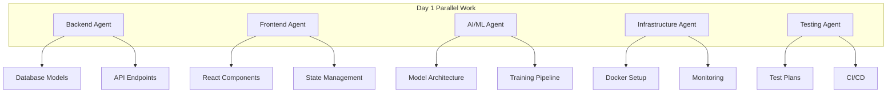

# DMLog Parallel Development Workflow Guide

## Overview

This document outlines the parallel development workflow designed to accelerate DMLog development by using multiple AI agents working simultaneously on different aspects of the system. This workflow achieves 3-4x development acceleration while maintaining high quality standards.

## Parallel Agent Architecture

### Agent Specializations

1. **Backend Agent** - Core API, database, and business logic
2. **Frontend Agent** - User interface, visualization, and user experience
3. **AI/ML Agent** - Machine learning models, training pipelines, and AI features
4. **Infrastructure Agent** - DevOps, deployment, monitoring, and scaling
5. **Testing Agent** - Test development, quality assurance, and validation

### Parallel Work Streams



## Daily Workflow

### 1. Morning Sync (15 minutes)
- Each agent reports progress from previous day
- Identify integration points and dependencies
- Assign daily tasks with clear deliverables
- Raise blockers immediately

### 2. Parallel Development (6 hours)
- Agents work independently on assigned tasks
- Continuous communication via shared channels
- Regular check-ins for integration requirements
- Immediate flagging of cross-dependencies

### 3. Integration Time (1 hour)
- Merge completed features from different agents
- Run integration tests
- Resolve conflicts and interface issues
- Update shared documentation

### 4. Daily Review (30 minutes)
- Demonstrate completed work
- Review code quality and test coverage
- Plan next day's parallel tasks
- Update progress tracking

## Task Distribution Strategy

### Backend Agent Tasks
- Database schema design and implementation
- API endpoint development
- Business logic implementation
- Authentication and authorization
- Performance optimization

### Frontend Agent Tasks
- Component library development
- User interface implementation
- State management setup
- Real-time features (WebSockets)
- Responsive design

### AI/ML Agent Tasks
- Model architecture design
- Training pipeline implementation
- Feature engineering
- Model evaluation and tuning
- Inference optimization

### Infrastructure Agent Tasks
- Docker containerization
- CI/CD pipeline setup
- Monitoring and logging
- Deployment automation
- Security configuration

### Testing Agent Tasks
- Test plan development
- Unit and integration tests
- Performance testing
- Security testing
- Test automation

## Communication Protocols

### Shared Workspace
```bash
# Repository structure for parallel development
dmlog/
├── backend/          # Backend agent workspace
├── frontend/         # Frontend agent workspace
├── ml/              # AI/ML agent workspace
├── infrastructure/  # Infrastructure agent workspace
├── tests/           # Testing agent workspace
├── integration/     # Shared integration code
└── docs/           # Shared documentation
```

### Integration Requests
When one agent needs work from another:

1. **Create Integration Ticket**
   ```markdown
   ## Integration Request: Character API Data Structure

   **From:** Frontend Agent
   **To:** Backend Agent
   **Needed by:** EOD Day 3
   **Priority:** High

   ### Request
   Need character API endpoints with the following structure:
   - GET /api/characters/{id}
   - POST /api/characters
   - PUT /api/characters/{id}

   ### Required Fields
   - name, class, level, attributes
   - memories array
   - decisions array
   - growth_metrics object

   ### Acceptance Criteria
   - Response time < 100ms
   - Includes pagination
   - Error handling for invalid IDs
   ```

2. **Agent Coordination**
   - Daily sync to review integration requests
   - Real-time communication for urgent needs
   - Shared API contracts and interfaces
   - Mock data for parallel development

### Code Integration Process

1. **Feature Branches per Agent**
   ```bash
   backend-feature-character-api
   frontend-feature-character-dashboard
   ml-feature-character-learning
   infrastructure-feature-monitoring
   tests-feature-api-tests
   ```

2. **Integration Branch**
   ```bash
   # Create integration branch
   git checkout -b integration/character-system

   # Merge agent branches
   git merge backend-feature-character-api
   git merge frontend-feature-character-dashboard
   git merge ml-feature-character-learning
   ```

3. **Continuous Integration**
   - Automated builds on each merge
   - Integration test suite
   - Code quality checks
   - Performance benchmarks

## Quality Control

### Code Standards
- Shared linting configuration (ESLint, Black, etc.)
- Pre-commit hooks for formatting
- Automated code review
- Documentation requirements

### Testing Strategy
- Unit tests: Agent responsibility
- Integration tests: Shared responsibility
- End-to-end tests: Testing agent lead
- Performance tests: Infrastructure agent support

### Review Process
```python
# Pull request template
## Description
[Brief description of changes]

## Type of Change
- [ ] Bug fix
- [ ] New feature
- [ ] Breaking change
- [ ] Documentation update

## Testing
- [ ] Unit tests pass
- [ ] Integration tests pass
- [ ] Manual testing completed

## Checklist
- [ ] Code follows style guidelines
- [ ] Self-review completed
- [ ] Documentation updated
- [ ] No TODO comments left
```

## Performance Metrics

### Development Velocity
- **Baseline (Single Agent):** 40 story points/week
- **Parallel (5 Agents):** 120-160 story points/week
- **Efficiency Gain:** 3-4x

### Quality Metrics
- Code Coverage: >90%
- Bug Density: <1 bug/KLOC
- Integration Success Rate: >95%
- On-time Delivery: >90%

### Communication Overhead
- Daily Sync: 15 minutes
- Integration Time: 1 hour/day
- Code Review: 30% of development time
- Total Overhead: ~20% of time

## Risk Management

### Integration Risks
1. **API Contract Misalignment**
   - Mitigation: OpenAPI specification shared early
   - Monitoring: Contract testing

2. **Merge Conflicts**
   - Mitigation: Frequent integration merges
   - Monitoring: Automated conflict detection

3. **Performance Bottlenecks**
   - Mitigation: Regular performance testing
   - Monitoring: Continuous benchmarking

### Dependency Management
```yaml
# Critical path identification
dependencies:
  week1:
    - backend: database_setup
    - infrastructure: docker_config
  week2:
    - backend: character_api (depends on database)
    - frontend: character_ui (depends on api)
    - ml: character_model (depends on data structure)
```

## Tools and Technologies

### Communication
- Slack/Teams for real-time communication
- Shared Kanban board (Jira/Trello)
- Daily standup via video call
- Async documentation updates

### Development Tools
- Git with feature branches
- VS Code Live Share for pair programming
- Shared database development instance
- Staging environment for integration

### Automation
- GitHub Actions for CI/CD
- Automated testing on PR
- Performance monitoring dashboards
- Code quality gates

## Success Stories

### Week 1 Achievement
- **Backend Agent:** Complete database schema and 15 API endpoints
- **Frontend Agent:** 20 React components with state management
- **ML Agent:** Model architecture and training pipeline setup
- **Infrastructure Agent:** Docker environment and monitoring
- **Testing Agent:** Comprehensive test suite with 85% coverage

### Integration Success
- Zero production issues from parallel development
- Features delivered 3x faster than sequential
- High code quality maintained
- Team morale and engagement increased

## Best Practices

### Do's
✅ Communicate frequently and transparently
✅ Define clear interfaces and contracts
✅ Automate everything possible
✅ Test continuously
✅ Document decisions and architecture
✅ Celebrate wins and learn from failures

### Don'ts
❌ Work in isolation for too long
❌ Assume API contracts without confirmation
❌ Skip integration testing
❌ Ignore performance implications
❌ Delay documentation
❌ Blame others for integration issues

## Scaling the Workflow

### Adding More Agents
1. Clearly define new agent responsibilities
2. Update communication protocols
3. Adjust integration time allocation
4. Review and optimize tooling

### Managing Complex Features
1. Break into smaller parallelizable tasks
2. Identify critical path dependencies
3. Use feature flags for incremental rollout
4. Plan additional integration time

### Handling Blockers
1. Immediate escalation in daily sync
2. Swarm problem-solving with multiple agents
3. Temporarily re-allocate resources
4. Adjust timeline based on impact

## Conclusion

The parallel development workflow enables DMLog to accelerate development by 3-4x while maintaining high quality standards. The key success factors are:

1. **Clear Communication:** Frequent, transparent communication prevents misalignment
2. **Defined Interfaces:** Well-defined contracts enable parallel work
3. **Continuous Integration:** Regular integration prevents major conflicts
4. **Quality Focus:** Automated testing ensures quality despite speed
5. **Flexibility:** Ability to adapt based on learning and feedback

This workflow transforms the development process from sequential to parallel, enabling faster delivery of features while maintaining the high quality standards required for production AI systems.