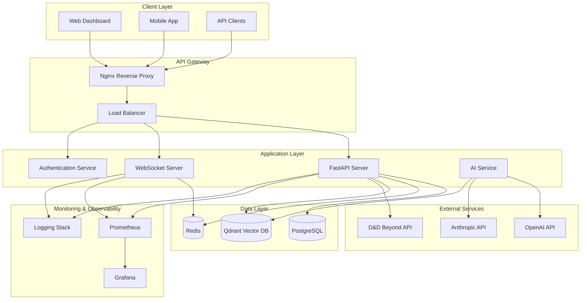
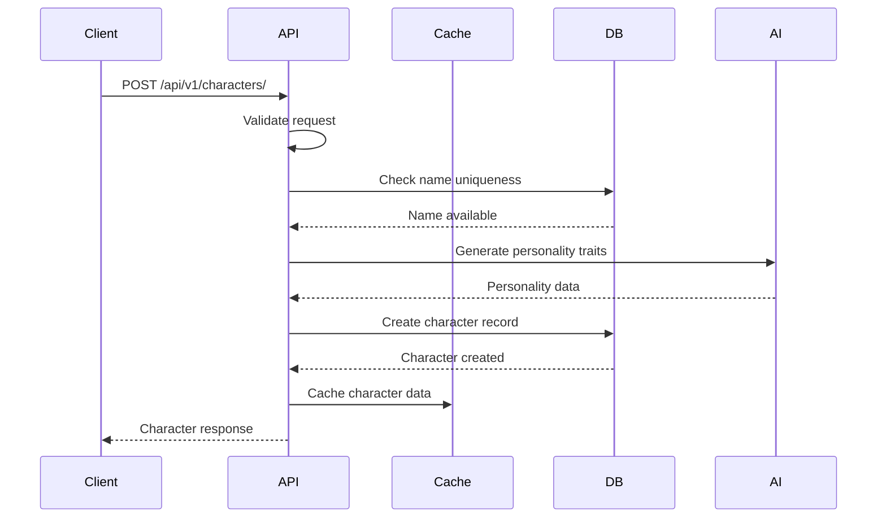
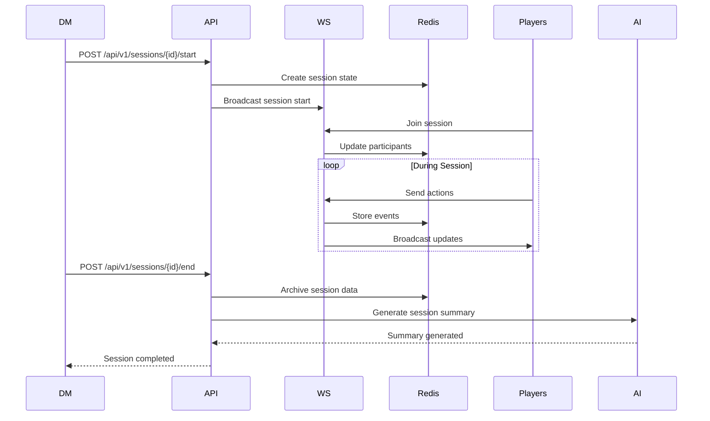

# DMLog Architecture Documentation

## Overview

DMLog is a comprehensive Dungeons & Dragons campaign management system built with modern, scalable architecture patterns. The system uses a microservices-inspired approach with clear separation of concerns, real-time capabilities, and AI-powered features.

## System Architecture



## Technology Stack

### Backend
- **Framework**: FastAPI 0.104+ (Python 3.11+)
- **Database**: PostgreSQL 15+ with asyncpg driver
- **Cache**: Redis 7+ for caching and session management
- **Vector DB**: Qdrant for AI memory embeddings
- **ORM**: SQLAlchemy 2.0 with async support
- **Migrations**: Alembic
- **WebSocket**: Native FastAPI WebSocket support

### Frontend
- **Framework**: Vanilla JavaScript with Bootstrap 5
- **Real-time**: WebSocket client
- **Charts**: Chart.js for analytics
- **UI Components**: Bootstrap 5 with custom themes

### Infrastructure
- **Containerization**: Docker & Docker Compose
- **Reverse Proxy**: Nginx
- **Monitoring**: Prometheus + Grafana
- **Logging**: Structured logging with ELK stack (optional)
- **Deployment**: Shell scripts with environment configurations

### AI/ML
- **Models**: OpenAI GPT-4, Anthropic Claude
- **Vector Operations**: Qdrant for similarity search
- **Embeddings**: OpenAI text-embedding-ada-002
- **Fine-tuning**: QLoRA for custom character personalities

## Core Components

### 1. API Server (`api_server_new.py`)

The main FastAPI application that handles HTTP requests and routes them to appropriate handlers.

**Key Features:**
- Async request handling
- Comprehensive middleware stack
- Automatic OpenAPI documentation
- Health check endpoints
- Request validation with Pydantic

**Middleware Stack:**
```python
1. CORS Middleware
2. Rate Limiting Middleware
3. Security Headers Middleware
4. Error Handling Middleware
5. Timing Middleware
6. Logging Middleware
```

### 2. Database Layer

**Models (`database/models/`):**
- Character, Campaign, Session models
- Full D&D 5e support
- Relationship definitions
- Indexes and constraints

**Repositories (`database/repositories/`):**
- Data access abstraction
- Async database operations
- Caching integration
- Query optimization

**Connection Management:**
- Connection pooling
- Async session handling
- Transaction management
- Health monitoring

### 3. Caching Layer

**Redis Integration (`cache/`):**
- Session storage
- Query result caching
- Real-time data synchronization
- Pub/Sub for WebSocket communication

**Cache Strategies:**
- Write-through caching for characters
- TTL-based caching for sessions
- Invalidation on updates
- Cache warming for frequent queries

### 4. WebSocket System

**Real-time Features (`api/websocket.py`):**
- Live session updates
- Dice rolling synchronization
- Combat tracking
- Chat functionality

**Message Types:**
```typescript
interface WebSocketMessage {
    type: 'join' | 'leave' | 'dice_roll' | 'combat_update' | 'chat';
    data: any;
    session_id?: string;
    user_id: string;
    timestamp: string;
}
```

### 5. AI Integration

**Character AI (`services/character_ai.py`):**
- Personality modeling
- Decision making
- Memory consolidation
- Cultural transmission

**Memory System (`memory_system.py`):**
- Vector embeddings for memories
- Importance scoring
- Retrieval and consolidation
- Cross-character influence

## Data Flow

### Character Creation Flow



### Session Management Flow



## Security Architecture

### Authentication & Authorization

**Current Implementation:**
- API key-based authentication
- Simple role-based access control
- Session-based authorization

**Planned Enhancements:**
- OAuth 2.0 integration
- JWT tokens with refresh
- Fine-grained permissions
- Multi-factor authentication

### Data Protection

**Encryption:**
- TLS 1.3 for all communications
- Database encryption at rest
- API key encryption in storage
- Sensitive data masking

**Input Validation:**
- Pydantic schema validation
- SQL injection prevention
- XSS protection
- CSRF protection

### Rate Limiting

**Implementation:**
- Redis-based rate limiting
- Per-client rate limits
- Endpoint-specific limits
- Burst protection

## Performance Architecture

### Scalability Patterns

**Horizontal Scaling:**
- Stateless API servers
- Database read replicas
- Redis clustering
- Load balancing

**Caching Strategy:**
- Multi-level caching
- Cache warming
- Intelligent invalidation
- CDN integration

### Database Optimization

**Indexing Strategy:**
- Primary key indexes
- Foreign key indexes
- Query-specific indexes
- Partial indexes for active data

**Query Optimization:**
- Connection pooling
- Prepared statements
- Batch operations
- Query analysis

### Monitoring & Observability

**Metrics Collection:**
- Application metrics (request count, duration)
- Database metrics (query performance, connections)
- Cache metrics (hit rates, memory usage)
- System metrics (CPU, memory, disk)

**Health Checks:**
- Component health monitoring
- Dependency health checks
- Graceful degradation
- Circuit breakers

## Deployment Architecture

### Container Strategy

**Multi-stage Dockerfile:**
```dockerfile
# Stage 1: Build
FROM python:3.11-slim as builder
# Build dependencies and application

# Stage 2: Runtime
FROM python:3.11-slim as runtime
# Copy only necessary files
# Install runtime dependencies
# Configure application
```

### Environment Configuration

**Development:**
- Local database and Redis
- Debug mode enabled
- Hot reloading
- Development tools

**Production:**
- Managed database services
- Optimized configuration
- Security hardening
- Monitoring enabled

### CI/CD Pipeline

**Build Process:**
1. Code checkout
2. Dependency installation
3. Test execution
4. Security scanning
5. Docker image building
6. Image pushing to registry
7. Deployment to environment

## AI Architecture

### Character Personality System

**Personality Modeling:**
- Big Five personality traits
- D&D alignment mapping
- Background influences
- Experience-based evolution

**Decision Making:**
- Context-aware decisions
- Confidence scoring
- Risk assessment
- Multi-criteria evaluation

### Memory System

**Memory Types:**
- Episodic memories (events)
- Semantic memories (knowledge)
- Procedural memories (skills)
- Emotional memories (feelings)

**Memory Operations:**
- Encoding (initial storage)
- Consolidation (strengthening)
- Retrieval (accessing)
- Forgetting (decay)

### Cultural Transmission

**Transmission Mechanisms:**
- Direct interaction
- Storytelling
- Observation
- Shared experiences

**Cultural Elements:**
- Knowledge and skills
- Values and beliefs
- Traditions and customs
- Language and communication

## Integration Architecture

### D&D Beyond Integration

**API Integration:**
- Character import/export
- Content synchronization
- Compendium access
- Marketplace integration

### Third-party Services

**Voice Chat:**
- WebRTC implementation
- Audio processing
- Session recording
- Voice commands

**Analytics:**
- Usage tracking
- Performance metrics
- User behavior analysis
- Business intelligence

## Future Architecture Enhancements

### Microservices Migration

**Service Decomposition:**
- Character Service
- Campaign Service
- Session Service
- AI Service
- Analytics Service

**Service Communication:**
- Event-driven architecture
- Message queues (RabbitMQ/Kafka)
- Service mesh (Istio)
- API gateway patterns

### Edge Computing

**CDN Integration:**
- Static asset delivery
- API edge caching
- Geographic distribution
- Reduced latency

### Advanced AI Features

**Multi-modal AI:**
- Voice recognition
- Image generation
- Natural language understanding
- Real-time translation

**Learning Systems:**
- Reinforcement learning
- Federated learning
- Transfer learning
- Continual learning

## Architecture Decision Records (ADRs)

### ADR-001: FastAPI Framework Choice
**Decision**: Chose FastAPI over Flask/Django
**Rationale**: Native async support, automatic documentation, type hints, performance
**Consequences**: Modern Python patterns, excellent tooling, learning curve

### ADR-002: PostgreSQL Database
**Decision**: Chose PostgreSQL over MongoDB/MySQL
**Rationale**: ACID compliance, JSON support, vector extensions, reliability
**Consequences**: Strong consistency, complex queries, migration path

### ADR-003: Redis Caching
**Decision**: Chose Redis over Memcached
**Rationale**: Data structures, persistence, pub/sub, clustering
**Consequences**: Rich feature set, memory usage, complexity

### ADR-004: Vector Database
**Decision**: Chose Qdrant over Pinecone/Weaviate
**Rationale**: Open source, performance, Docker support, API design
**Consequences**: Self-hosting, control, maintenance overhead

## Architecture Standards

### Code Organization
```
source_code/backend/
├── api/                    # API layer
│   ├── routers/           # Route handlers
│   ├── schemas/           # Pydantic models
│   ├── middleware/        # Custom middleware
│   └── exceptions/        # Exception handling
├── database/              # Data layer
│   ├── models/           # SQLAlchemy models
│   ├── repositories/     # Data access
│   └── connection/       # DB configuration
├── cache/                 # Caching layer
├── services/              # Business logic
├── monitoring/            # Metrics and logging
└── config/                # Configuration
```

### Design Patterns
- **Repository Pattern**: Data access abstraction
- **Service Layer**: Business logic encapsulation
- **Factory Pattern**: Object creation
- **Observer Pattern**: Event handling
- **Strategy Pattern**: Algorithm selection

### Coding Standards
- Type hints for all functions
- Comprehensive docstrings
- Error handling with custom exceptions
- Consistent naming conventions
- Test coverage > 80%

## Performance Benchmarks

### API Performance
- **Response Time**: < 100ms (95th percentile)
- **Throughput**: 1000+ requests/second
- **Concurrent Users**: 500+ simultaneous
- **Database Queries**: < 10ms average

### WebSocket Performance
- **Latency**: < 50ms message delivery
- **Concurrent Connections**: 1000+ per server
- **Message Throughput**: 10,000+ messages/second
- **Memory Usage**: < 1MB per connection

### Caching Performance
- **Hit Rate**: > 90% for frequently accessed data
- **Cache Warm-up**: < 5 seconds
- **Memory Usage**: Configurable limits
- **Invalidation**: < 1ms propagation

This architecture provides a solid foundation for DMLog's current features while allowing for future growth and enhancement. The modular design, clear separation of concerns, and modern technology choices ensure maintainability, scalability, and performance.