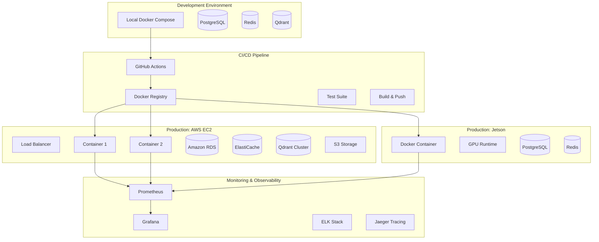

# DMLog Production Development Environment Architecture

## Executive Summary

This document outlines the complete production-ready development environment for DMLog, designed to support deployment across multiple platforms including local development, NVIDIA Jetson devices, and AWS EC2 instances. The architecture prioritizes scalability, observability, security, and developer experience.

## System Architecture Overview



## Core Components

### 1. Container Architecture

#### Multi-Stage Dockerfiles
- **Base Image**: Python 3.11-slim for production, 3.11 for development
- **GPU Support**: Separate CUDA-enabled images for ML training
- **Security**: Non-root user, minimal attack surface
- **Optimization**: Layer caching, .dockerignore, multi-stage builds

#### Service Containers
1. **API Server** (FastAPI)
   - RESTful API endpoints
   - WebSocket support for real-time updates
   - Background task processing
   - Health checks at /health

2. **ML Training Service**
   - GPU-enabled container
   - LoRA fine-tuning capabilities
   - Model versioning and storage
   - Training progress monitoring

3. **Task Queue Worker** (RQ)
   - Async job processing
   - Training job queue
   - Data processing tasks
   - Retry mechanisms

4. **Vector Database** (Qdrant)
   - Semantic search capabilities
   - Character memory storage
   - Distributed mode for production

5. **PostgreSQL Database**
   - Primary data store
   - Connection pooling
   - Read replicas for scaling
   - Automated backups

6. **Redis Cache**
   - Session storage
   - API response caching
   - Task queue broker
   - Rate limiting

### 2. Development Environment Setup

#### Local Development (docker-compose.dev.yml)
```yaml
# Hot-reload enabled
# Volume mounts for code
# Debug ports exposed
# Test database with seed data
# Local GPU passthrough (optional)
```

#### Staging Environment (docker-compose.staging.yml)
```yaml
# Production-like configuration
# No volume mounts (except logs)
# SSL/TLS termination
# Resource limits defined
# Monitoring enabled
```

#### Production Environment (docker-compose.prod.yml)
```yaml
# Multi-replica configuration
# Load balancer
# External database connections
# Full monitoring stack
# Auto-scaling enabled
```

### 3. Database Architecture

#### PostgreSQL Schema Design
```sql
-- Core tables
characters (id, name, class, level, created_at, updated_at)
sessions (id, character_id, start_time, end_time, status)
decisions (id, session_id, character_id, decision_type, context, outcome)
training_data (id, character_id, session_id, input_sequence, target_output)
model_versions (id, character_id, version, model_path, metrics, created_at)

-- Indexes for performance
CREATE INDEX idx_decisions_character_session ON decisions(character_id, session_id);
CREATE INDEX idx_training_data_character ON training_data(character_id);
```

#### Migration Strategy
1. **Phase 1**: Create migration scripts from SQLite to PostgreSQL
2. **Phase 2**: Implement data validation during migration
3. **Phase 3**: Zero-downtime migration with double-write
4. **Phase 4**: Cut over to PostgreSQL, deprecate SQLite

### 4. Machine Learning Infrastructure

#### GPU Training Container
```dockerfile
FROM nvidia/cuda:11.8-runtime-ubuntu22.04

# Install PyTorch with CUDA support
# Install transformers, peft, bitsandbytes
# Mount model storage volume
# Expose training metrics endpoint
```

#### Model Registry
- **Storage**: S3-compatible storage (MinIO for local, AWS S3 for cloud)
- **Versioning**: Semantic versioning with Git-like tags
- **Metadata**: Training metrics, dataset hashes, hyperparameters
- **Serving**: Direct loading from registry into inference

#### Training Pipeline
```python
# 1. Collect training data from decisions
# 2. Validate and preprocess data
# 3. Queue training job with priority
# 4. Execute LoRA fine-tuning on GPU
# 5. Validate model performance
# 6. Register model if criteria met
# 7. Deploy to inference endpoint
```

### 5. Security Architecture

#### Authentication & Authorization
- **API Keys**: HMAC-signed tokens for API access
- **OAuth2**: JWT tokens for user authentication
- **RBAC**: Role-based access control (admin, player, readonly)
- **Rate Limiting**: Token bucket algorithm per API key

#### Network Security
- **HTTPS**: TLS 1.3 termination at load balancer
- **Internal Network**: Docker network isolation
- **Firewall Rules**: Only necessary ports exposed
- **VPN Access**: SSH access through VPN only

#### Secret Management
- **Development**: .env files with .gitignore
- **Staging**: HashiCorp Vault or AWS Secrets Manager
- **Production**: KMS-encrypted secrets with rotation

### 6. Monitoring & Observability

#### Metrics Collection
```yaml
# Prometheus Configuration
global:
  scrape_interval: 15s

scrape_configs:
  - job_name: 'dmlog-api'
    static_configs:
      - targets: ['api:8000']
    metrics_path: '/metrics'
    scrape_interval: 5s

  - job_name: 'postgres'
    static_configs:
      - targets: ['postgres-exporter:9187']

  - job_name: 'redis'
    static_configs:
      - targets: ['redis-exporter:9121']
```

#### Logging Strategy
```python
# Structured logging with correlation IDs
import structlog

logger = structlog.get_logger()

# Log format: JSON with trace context
{
  "timestamp": "2024-01-01T12:00:00Z",
  "level": "info",
  "service": "api-server",
  "trace_id": "abc123",
  "span_id": "def456",
  "message": "Character decision processed",
  "character_id": "char_001",
  "decision_type": "combat",
  "processing_time_ms": 150
}
```

#### Distributed Tracing
- **OpenTelemetry**: Automatic instrumentation
- **Jaeger**: Trace storage and visualization
- **Sampling**: Probabilistic sampling for production
- **Correlation**: Request ID across all services

### 7. Deployment Configurations

#### NVIDIA Jetson Deployment
```yaml
# docker-compose.jetson.yml
version: '3.8'
services:
  dmlog:
    image: dmlog:jetson-latest
    runtime: nvidia
    environment:
      - NVIDIA_VISIBLE_DEVICES=all
      - CUDA_VISIBLE_DEVICES=0
    volumes:
      - /jetson/models:/app/models
      - /jetson/data:/app/data
    deploy:
      resources:
        reservations:
          devices:
            - driver: nvidia
              count: 1
              capabilities: [gpu]
```

#### AWS EC2 Deployment
```yaml
# docker-compose.aws.yml
version: '3.8'
services:
  api:
    image: dmlog:prod-${BUILD_NUMBER}
    replicas: 3
    environment:
      - DATABASE_URL=${RDS_CONNECTION_STRING}
      - REDIS_URL=${ELASTICACHE_CONNECTION_STRING}
      - QDRANT_URL=${QDRANT_CLUSTER_ENDPOINT}
    deploy:
      resources:
        limits:
          cpus: '1.0'
          memory: 2G
        reservations:
          cpus: '0.5'
          memory: 1G
```

### 8. CI/CD Pipeline

#### GitHub Actions Workflow
```yaml
name: DMLog CI/CD

on:
  push:
    branches: [main, develop]
  pull_request:
    branches: [main]

jobs:
  test:
    runs-on: ubuntu-latest
    steps:
      - uses: actions/checkout@v3
      - name: Run tests
        run: |
          docker-compose -f docker-compose.test.yml up --abort-on-container-exit
          docker-compose -f docker-compose.test.yml down

  build:
    needs: test
    runs-on: ubuntu-latest
    steps:
      - name: Build Docker images
        run: |
          docker build -t dmlog/api:${GITHUB_SHA} .
          docker build -t dmlog/ml-trainer:${GITHUB_SHA} -f Dockerfile.gpu .

      - name: Push to registry
        if: github.ref == 'refs/heads/main'
        run: |
          docker push dmlog/api:${GITHUB_SHA}
          docker push dmlog/ml-trainer:${GITHUB_SHA}

  deploy:
    needs: build
    runs-on: ubuntu-latest
    if: github.ref == 'refs/heads/main'
    steps:
      - name: Deploy to staging
        run: |
          # Deploy to staging environment

      - name: Run integration tests
        run: |
          # Run full integration test suite

      - name: Deploy to production
        if: success()
        run: |
          # Deploy to production with blue-green deployment
```

## Implementation Roadmap

### Phase 1: Foundation (Week 1-2)
- [ ] Create multi-environment Docker configurations
- [ ] Set up PostgreSQL migration from SQLite
- [ ] Implement basic monitoring (Prometheus + Grafana)
- [ ] Configure Redis caching layer
- [ ] Set up CI/CD pipeline basics

### Phase 2: ML Infrastructure (Week 3-4)
- [ ] Build GPU-enabled training containers
- [ ] Implement model registry with S3/MinIO
- [ ] Create training job queue with RQ
- [ ] Add ML-specific monitoring
- [ ] Implement A/B testing for models

### Phase 3: Security & Scaling (Week 5-6)
- [ ] Implement authentication & authorization
- [ ] Add SSL/TLS termination
- [ ] Configure rate limiting
- [ ] Set up log aggregation (ELK stack)
- [ ] Implement distributed tracing

### Phase 4: Production Deployment (Week 7-8)
- [ ] Deploy to AWS EC2 with auto-scaling
- [ ] Configure Jetson deployment
- [ ] Set up backup and disaster recovery
- [ ] Implement blue-green deployments
- [ ] Create runbooks and alerting

## Development Workflow

### 1. Local Development
```bash
# Clone repository
git clone https://github.com/yourorg/dmlog.git
cd dmlog

# Start development environment
docker-compose -f docker-compose.dev.yml up -d

# Run tests
pytest tests/

# View logs
docker-compose logs -f api

# Stop environment
docker-compose down
```

### 2. Making Changes
1. Create feature branch
2. Make changes with hot-reload
3. Run test suite automatically
4. Submit pull request
5. CI/CD pipeline runs tests
6. Merge to main triggers deployment

### 3. Monitoring in Development
- Grafana dashboard: http://localhost:3001
- Prometheus: http://localhost:9090
- Jaeger: http://localhost:16686
- Application logs: `docker-compose logs -f`

## Production Operations

### 1. Deployment Commands
```bash
# Deploy to production
./scripts/deploy.sh production

# Check deployment status
./scripts/health-check.sh production

# Rollback deployment
./scripts/rollback.sh production
```

### 2. Monitoring Alerts
- API response time > 500ms
- Error rate > 5%
- Database connections > 80%
- GPU utilization > 95%
- Disk space > 85%

### 3. Backup Procedures
```bash
# Database backup
pg_dump $DATABASE_URL > backup_$(date +%Y%m%d).sql

# Model registry backup
aws s3 sync s3://dmlog-models s3://dmlog-models-backup

# Configuration backup
kubectl get configmaps -o yaml > config_backup.yaml
```

## Security Best Practices

1. **Container Security**
   - Use distroless images where possible
   - Scan images for vulnerabilities (Trivy)
   - Run as non-root user
   - Implement resource limits

2. **API Security**
   - Input validation and sanitization
   - SQL injection prevention
   - XSS protection
   - CSRF tokens

3. **Data Protection**
   - Encrypt data at rest (AES-256)
   - Encrypt data in transit (TLS 1.3)
   - PII anonymization
   - GDPR compliance

## Performance Optimization

1. **Database Optimization**
   - Connection pooling (PgBouncer)
   - Read replicas for scaling
   - Query optimization
   - Indexing strategy

2. **Caching Strategy**
   - API response caching (Redis)
   - Database query caching
   - Model inference caching
   - CDN for static assets

3. **Resource Management**
   - Auto-scaling based on CPU/memory
   - GPU sharing for training jobs
   - Job queue priority management
   - Graceful degradation under load

## Troubleshooting Guide

### Common Issues

1. **Container won't start**
   ```bash
   # Check logs
   docker-compose logs service_name

   # Check resource usage
   docker stats

   # Verify configuration
   docker-compose config
   ```

2. **Database connection issues**
   ```bash
   # Test connectivity
   pg_isready -h localhost -p 5432

   # Check connection pool
   SELECT * FROM pg_stat_activity;
   ```

3. **GPU not accessible**
   ```bash
   # Check GPU visibility
   nvidia-smi

   # Check Docker runtime
   docker info | grep nvidia
   ```

## Conclusion

This production environment architecture provides a robust, scalable, and secure foundation for DMLog across multiple deployment targets. The modular design allows for incremental implementation and ensures that the system can grow with demand while maintaining reliability and performance.

The architecture emphasizes:
- **Developer Experience**: Easy local setup and debugging
- **Scalability**: Horizontal scaling and resource optimization
- **Reliability**: Comprehensive monitoring and fault tolerance
- **Security**: Defense-in-depth security posture
- **Flexibility**: Multi-platform deployment capability

Following this roadmap will result in a production-grade DMLog system capable of handling real-world workloads while maintaining the sophisticated AI capabilities that make the system unique.